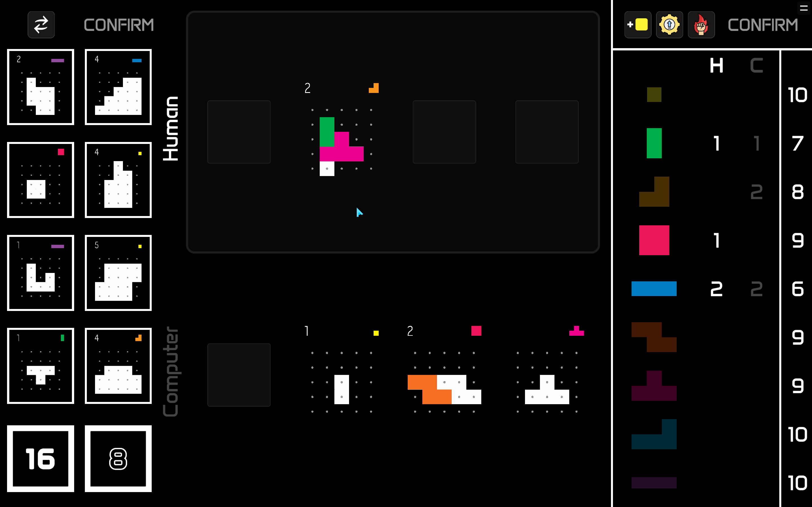

# Project L

**Project L** is a strategic board game for up to 4 players created by [Boardcubator](https://www.boardcubator.com/games/project-l/). The main goal of the game is to solve puzzles by filling them in with colorful tetromino pieces. When you finish a puzzle, you get some points and also a new piece as a reward. By doing this, you increase your collection of pieces and can solve more difficult puzzles. If you don't have enough pieces to solve a puzzle, you can trade the pieces you have for new ones or take a new basic piece from the shared reserve.

This project is a digital version of the game that can be played by both human and AI players.

## [Play Project L Online](https://couleslaw.github.io/Project-L/game/)

Experience the game in your browser. Please note: AI players are not available in this version.

## [Download Project L](https://github.com/Couleslaw/Project-L/releases/latest)

If you want to try playing against some AI players you can download the game and play it offline. It is available for Windows, MacOS and Linux.

There is one built-in AI player, but you can also implement your own AI players.

## User Guide

The [User Guide](https://couleslaw.github.io/Project-L/UserDocs/) explains the rules and how to play the game.

## Crate Your Own AI Player

You can create your own AI player by simply implementing the methods of the [AIPlayerBase](https://couleslaw.github.io/Project-L/ProjectLCoreDocs/html/T_ProjectLCore_Players_AIPlayerBase.htm) abstract class. Specifically:

- [Init](https://couleslaw.github.io/Project-L/ProjectLCoreDocs/html/M_ProjectLCore_Players_AIPlayerBase_Init.htm) – initializes the player
- [GetAction](https://couleslaw.github.io/Project-L/ProjectLCoreDocs/html/M_ProjectLCore_Players_AIPlayerBase_GetAction.htm) – chooses the next action to take
- [GetReward](https://couleslaw.github.io/Project-L/ProjectLCoreDocs/html/M_ProjectLCore_Players_AIPlayerBase_GetReward.htm) – selects a reward for completing a puzzle

More detailed information on creating AI players is available in the [AI Player Guide](https://couleslaw.github.io/Project-L/AIPlayerGuide/index).

## How Does It Work?

The Unity version of the game is built on top of the **ProjectLCore** library, which contains all the core game logic. **ProjectLCore** is completely independent from Unity, making it suitable for training AI players or building other interfaces. The Unity implementation simply provides a user interface and connects to this core library.

Because of this separation, the documentation is split into two parts:

- The [Library docs](https://couleslaw.github.io/Project-L/TechnicalDocs/core/) cover the inner workings of the [Project-L Core](https://couleslaw.github.io/Project-L/ProjectLCoreDocs/) library.
- The [Unity docs](https://couleslaw.github.io/Project-L/TechnicalDocs/unity/) explain how the Unity-based game client is implemented.

## Used Technologies

- **[Unity 6000.0.37f1](https://unity.com/)** – the main game engine used to build the digital version of Project L.
- **[Visual Studio 2022](https://visualstudio.microsoft.com/vs/)** – the primary IDE for writing and debugging code.
- **[NuGet for Unity](https://github.com/GlitchEnzo/NuGetForUnity)** – manages .NET packages inside Unity.
- **[Figma](https://www.figma.com/)** – used to design the game’s graphics and user interface.
- **[Sandcastle Help File Builder](https://github.com/EWSoftware/SHFB)** – generates documentation for the ProjectLCore library.
- **[DocFX](https://dotnet.github.io/docfx/)** – creates documentation for the Unity-based parts of the project.
- **[Ini-parser](https://www.nuget.org/packages/ini-parser-netstandard)** – parses the AI player configuration file.
- **[Unity Logger](https://github.com/herbou/Unity_Logger)** – adds an in-game logging feature for easier AI player debugging.
