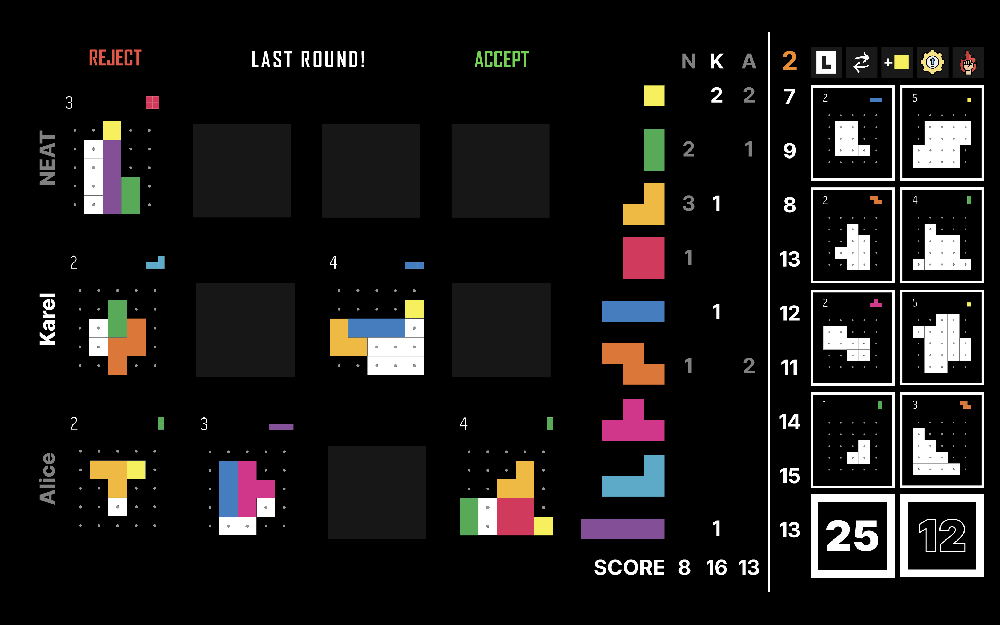

<link rel='stylesheet' href='../css/markdown-alert.css'/>

# Functional Specification

## Overview

This project is a Unity implementation of the **Project L** board game published by [Boardcubator](https://boardcubator.com/). It is a strategy game designed for 1-4 players, in which the players solve puzzles and collect tetrominos. You can either play against your friends or you can create your own AI players and play against them. Or both!

**This spec is not, by any stretch of the imagination, complete.** All of the wording will need to be revised several times before it is finalized. The graphics and layout of the screens is shown here merely to illustrate the underlying functionality. The actual look will be added once the game is finished.

This spec doesn't discuss the technical side of things (how it works). If you are interested in that, please check the [Technical Documentation](../TechnicalDocs/core/index).

## Scenarios

Alice and her friend Charlie want to try a new strategic game and so Alice decides to fire up her newest discovery - _Project L_. After reading the [user guide](../UserDocs/index), they are ready to play. They simply create a new game, add two players named Alice and Charlie and soon they are solving puzzles and increasing their tetromino collection.

The next day, Alice decides to also invite her friend Karel to play with them. Karel is studying computer science, so when Alice starts creating a new game, he gets immediately interested by the option of adding AI players to the game. During the weekend, he reads the AI player creation [guide](../AIPlayerGuide/index), implements the necessary interface, exports his project as a DLL and now he is ready to play against his own creation.

## Non Goals

This project will _not_ support the following features:

- online play
- saving and loading of unfinished games
- any of the expansions of the original game

## Screen by Screen Specification

The game consists of a couple of different screens which Alice and Charlie will encounter when playing the game. First they will see the [<u>Start Screen</u>](#start-screen), where they can create a new game or view the user guide. After that, they will be taken to the [<u>New Game</u>](#new-game) screen, where they can add players and set up the game. Once they are ready, they will be taken to the [<u>Main Game</u>](#main-game) screen, where they will play the game. Finally, when the game is over, they will be taken to the [<u>End Screen</u>](#end-screen), where they can see the results of the game, decide who won and buy the winner a nice trophy.

Screens are referred to by their canonical names, always underlined in this document, e.g. <u>Start Screen</u>.

## Start Screen

The first thing Alice and Charlie will see when they start the game is the following:

The <u>Start Screen</u> contains the buttons:

- **NEW GAME** - takes you to the [<u>New Game</u>](#new-game) screen
- **USER GUIDE** - opens the [User Guide](../UserDocs/index) in your browser
- **CREDITS** - takes you to the [<u>Credits</u>](#credits) screen

## Credits

After trying out what the **CREDITS** button in the [<u>Start Screen</u>](#start-screen) does, Alice and Charlie ended up here:

After about 3 seconds the "Click or press any key to go back" message appeared, and so they clicked on the screen. The game took them back to the [<u>Start Screen</u>](#start-screen).

## New Game

Karel created his own AI player which uses the NEAT algorithm to decide the next action. After clicking the **NEW GAME** button in the [<u>Start Screen</u>](#start-screen) he was taken here.

Karel added his NEAT player to the .json defining available AI players, as specified in the [AI Player Guide](../AIPlayerGuide/index). He wants to test if it works correctly by playing a game against it.

He clicks on the dropdown menu for the type of the first player, selects "Human" and enters his name. From the dropdown menu for the second player he chooses "NEAT" and come ups with a name for it.

He then uses the slider below to set the number of pieces of each type in the shared reserve at the beginning of the game (default is 15) and decides he wants to shuffle the players (randomized player order) to make things more interesting.

After that he just hits "Start game" and is taken to the [<u>Main Game</u>](#main-game) screen.

### Player selection in detail

The game can can be played by a maximum of 4 players and minimum of 1 player (it might not be very interesting though). To add a player, Karel needs to select a plyer type from the dropdown menu and add a name.



Once at least one parameter for a player is set, a restart button will appear on the right. The player can then me removed by clicking on it. Then game can not be started until at least one player is added. If a player is only partially defined (e.g. only a name is set), the game can not be started either.

The number of starting pieces in the shared reserve is 15 by default (the value in the original game), but can be adjusted using a slider below the player selection. The minimum number of pieces is 10 and the maximum is 30.

Players are shuffled by default to ensure random order of play. This can be turned off by unchecking the checkbox below the player selection. In that case, the order of play is specified by the numbers next to the players in the [<u>New Game</u>](#new-game) screen.

## Main Game

After Karel is done creating the game for him, Alice and his NEAT algorithm AI player, he clicks on the **Start game** button and is taken to the [<u>Main Game</u>](#main-game) screen. After playing for a while, he takes a screenshot of the game to show it to his friends.

## End Screen
