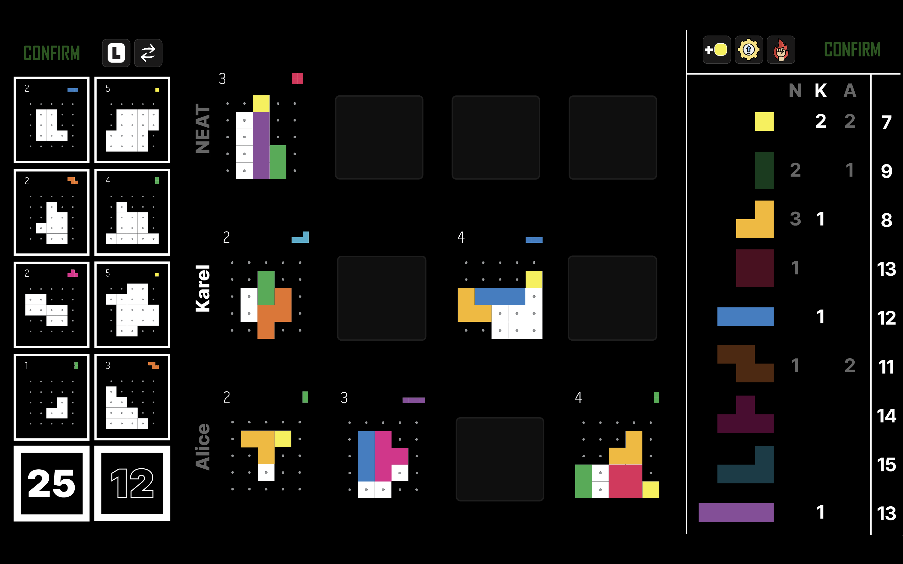
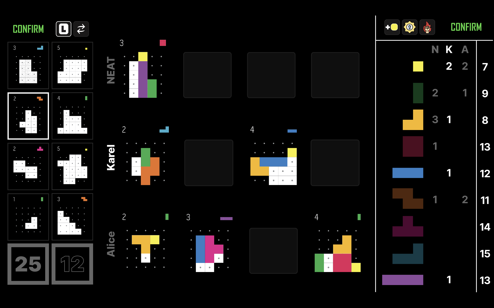
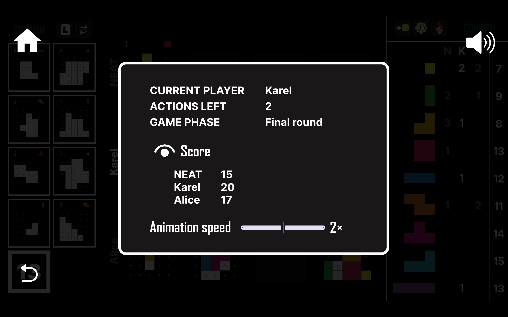
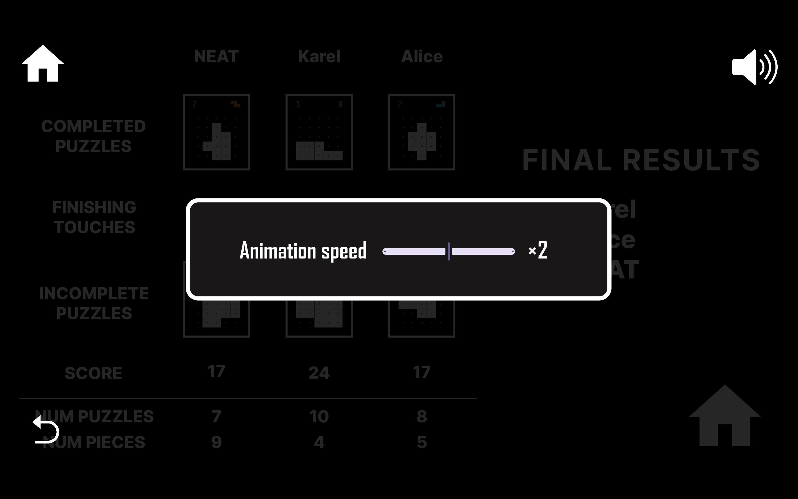

<link rel='stylesheet' href='../css/markdown-alert.css'/>

# Functional Specification

## Overview

This project is a Unity implementation of the **Project L** board game published by [Boardcubator](https://boardcubator.com/). It is a strategy game designed for 2-4 players, in which the players solve puzzles and collect tetrominos. You can either play against your friends or you can create your own AI players and play against them. Or both!

This spec doesn't discuss the technical side of things (how it works). If you are interested in that, please read the [Technical Documentation](../TechnicalDocs/core/index).

## Scenarios

Alice and her friend Charlie want to try a new strategic game and so Alice decides to fire up her newest discovery - _Project L_. After reading the [user guide](../UserDocs/index), they are ready to play. They simply create a new game, add two players named Alice and Charlie and soon they are solving puzzles and building their tetromino piece collection.

The next day, Alice decides to also invite her friend Karel to play with them. Karel is studying computer science, so when Alice starts creating a new game, he gets immediately interested by the option of adding AI players to the game. During the weekend, he reads the AI player creation [guide](../AIPlayerGuide/index), implements the necessary interface, exports his project as a DLL and now he is ready to play against his own creation.

## Non Goals

This project will _not_ support the following features:

- online play
- saving and loading of unfinished games
- any of the expansions of the original game

## Screen by Screen Specification

The game consists of a couple of different screens which Alice and Charlie will encounter when playing the game. First they will see the [<u>Start Screen</u>](#start-screen), where they can create a new game or view the user guide. After that, they will be taken to the [<u>New Game</u>](#new-game) screen, where they can add players and set up the game. Once they are ready, they will be taken to the [<u>Main Game</u>](#main-game) screen, where they will play the game. Finally, when the game is over, they will be taken to the [<u>Final Results</u>](#final-results) screen, where they can see the results of the game and buy the winner a nice trophy.

Screens are referred to by their canonical names, always underlined in this document, e.g. <u>Start Screen</u>.

### Table of Contents

- [Start Screen](#start-screen)
- [Credits](#credits)
- [New Game](#new-game)
- [Main Game](#main-game)
  - [AI Player Initialization Errors](#ai-player-initialization-errors)
  - [Main Game Zones](#main-game-zones)
    - [Player Zone](#player-zone)
    - [Piece Zone](#piece-zone)
    - [Puzzle Zone](#puzzle-zone)
    - [Action Zones](#action-zones)
  - [Creating Actions](#creating-actions)
    - [Place Piece](#place-piece)
    - [Take Puzzle](#take-puzzle)
    - [Recycle](#recycle)
    - [Take Basic Piece](#take-basic-piece)
    - [Upgrade](#upgrade)
    - [Master](#master)
    - [End Finishing Touches](#end-finishing-touches)
  - [Completing Puzzles](#completing-puzzles)
  - [Main Game Pause Menu](#main-game-pause-menu)
  - [Game Ended](#game-ended)
- [Final Results](#final-results)
  - [Final Results Pause Menu](#final-results-pause-menu)

## Start Screen

The first thing Alice and Charlie will see when they start the game is the following:

The <u>Start Screen</u> contains the buttons:

- **NEW GAME** - takes you to the [<u>New Game</u>](#new-game) screen
- **USER GUIDE** - opens the [User Guide](../UserDocs/index) in your browser
- **CREDITS** - takes you to the [<u>Credits</u>](#credits) screen
- **QUIT** - exits the game

## Credits

After trying out what the **CREDITS** button in the [<u>Start Screen</u>](#start-screen) does, Alice and Charlie ended up here:

They don't want to read a novel but to play a game and so they click on the arrow in the bottom left corner to get back to the [<u>Start Screen</u>](#start-screen).

## New Game

Karel created his own AI player which uses the NEAT algorithm to decide the next action. After clicking the **NEW GAME** button in the [<u>Start Screen</u>](#start-screen) he was taken here.

Karel added his NEAT player to the INI file defining available AI players, as specified in the [AI Player Guide](../AIPlayerGuide/index). He wants to test if it works correctly by playing a game against it.

He clicks on the dropdown menu for the type of the first player, selects "Human" and enters his name. From the dropdown menu for the second player he chooses "NEAT" and come ups with a name for it.

He then uses the slider below to set the initial amount of pieces of each type in the shared reserve and decides he wants to shuffle the players to make things more interesting.

After that he just hits "Start game" and is taken to the [<u>Main Game</u>](#main-game) screen.

If Alice had a change of heart and wanted to read the credits, she could click on the arrow in the bottom left corner to go back to the [<u>Start Screen</u>](#start-screen).

### Player selection in detail

The game can can be played by a maximum of 4 players and a minimum of 1 player (it might not be very interesting though). To add a player, Karel needs to select a type from the dropdown menu and add a name.





Once at least one parameter for a player is set, the reset button will appear to the right of their name. The player information can then be cleared by clicking on it. The game cannot be started until at least one player is added. If a player is only partially defined (e.g. only a name is set), the game cannot be started either.

The number of starting pieces in the shared reserve is 15 by default (the value in the original game), but can be adjusted using a slider below the player selection. The minimum number of pieces is 10, the maximum is 30 and the tick interval is 5.

Players are shuffled by default to ensure random order of play. This can be turned off by unchecking the checkbox below the player selection. In that case, the order of play is specified by the numbers left of the players in the [<u>New Game</u>](#new-game) screen.

## Main Game

After Karel is done creating the game for him, Alice and his NEAT algorithm AI player, he clicks on the **Start game** button and is taken to the <u>Main Game</u> screen. After playing for a while, he takes a screenshot of the game to show it to his friends.

### AI Player Initialization Errors

When the game starts, an initialization method is called for all AI players in the game. If an AI player fails to initialize (an exception is thrown), the game will announce that it cannot continue and will return to the [<u>Start Screen</u>](#start-screen).

### Main Game Zones



The <u>Main Game</u> screen is subdivided into multiple subsections as seen in the image below.

#### <u>Player Zone</u>

Contains the unfinished puzzles of each player.

- There is a row of 4 puzzles / blanks on the right of each player's name.
- For example, Karel has 2 unfinished puzzles and 2 empty slots.
- The first player has the first row, the second player has the second row, etc.
- The name of the current player (Karel) is **highlighted**.

#### <u>Piece Zone</u>

Contains information about the number of pieces owned by each player and the number of pieces left in the shared reserve. It consists of several columns which from left to right are:

- A column of all piece types in the game (`O1`, `I2`, `L2`, `O2`, `I3`, `Z`, `T`, `L3`, `I4` in order from top to bottom).
- One column for each player (NEAT, Karel and Alice), which says how many pieces of each type they have.
  - The first letter of each player's name (N, K and A) is displayed above their respective column.
  - The first player has the first column, the second player has the second column, etc.
  - The column of the current player (Karel) is **highlighted**.
- Lastly, there is a column with the number of pieces left in the shared reserve.

For example, NEAT has 3 `L2` pieces, Karel has 1, Alice has 0 and there are 8 left in the shared reserve.

The pieces the current player (Karel) doesn't have are **grayed out**. For example, the shapes which _aren't_ grayed out on the reference [image](#main-game) are `O1`, `L2`, `I3`, `I4`, because Karel has them in his collection.



#### <u>Puzzle Zone</u>

Consists of the following:

- Column of white puzzles which can be taken by the current player.
  - The <u>White Deck Card</u> located below this column indicates the number of puzzles left in the white deck - 25 in this case.
- Column of black puzzles and the <u>Black Deck Card</u> indicating the number of puzzles left in the back deck (12).



When either of the decks become empty, the corresponding <u>Deck Card</u> will disappear. If it is the black deck, the end of the game will be triggered.

#### Action Zones

Located above the <u>Puzzle Zone</u> and <u>Piece Zone</u> and used for creating actions. The <u>Puzzle Action Zone</u> contains:

- <u>Take Puzzle</u> - used for taking a puzzle from the <u>PuzzleZone</u>.
- <u>Recycle</u> - recycles the black or white column in the <u>Puzzle Zone</u>.

The <u>Piece Action Zone</u> contains:

- <u>Take Basic Piece</u> - gives the player the `O1` piece from the shared reserve.
- <u>Upgrade</u> - changes one piece for another.
- <u>Master</u> - parallel place action.



When the game comes to the Finishing Touches phase, the <u>End Finishing Touches</u> buttons appear in both of the <u>Action Zones</u>. They replace all other buttons (including the confirm buttons) which were there originally.

### Creating Actions

When Alice first enters the <u>Main Game</u> screen, she has no puzzles, so for her first action she decides to take a puzzle from the <u>Puzzle Zone</u>. She clicks on <u>Take Puzzle</u>, selects a puzzle by clicking on it, confirms her selection, and the puzzle appears in her row in the <u>Player Zone</u>.

Now she would like to complete the puzzle to get the reward. Thankfully, every player gets two pieces (`O1` and `I2`) at the start of the game. She decides to place the `I2` piece, so she drags it onto the puzzle using her mouse. Then she rotates the piece with the mouse wheel and once she's happy with the position, she clicks to lock it in place. After contemplating for a bit, she changes her mind about the placement, so she drags the piece to a new position, locks it in place and confirms her action.

#### Creating Actions in Detail

The general process of creating an action is as follows:

1. Start dragging a piece from the <u>Piece Zone</u> to use the _Place action_ or click the appropriate button in the <u>Action Zones</u> to use any of the other actions.
2. After a valid action is created, the <u>Confirm</u> buttons will be enabled. Clicking on one of them will confirm the action and the game will be updated accordingly. The action can also be confirmed by pressing the **Enter** key on your keyboard.



Once you click an action button in the <u>Action Zone</u>, it will be **highlighted**. Clicking on it again will unselect it and cancel the action creation process. Clicking on a different action button is equivalent to pressing the selected button again and then clicking on the new action button.

AI player actions are visualized in the same way as human player actions. If an AI player fails to provide a valid action, the game will simply ignore it (skip it).

#### Place Piece

Drag a piece you own from the <u>Piece Zone</u> to the <u>Player Zone</u> and place it on a puzzle. The piece will be **highlighted**.

- If you release the mouse button while the piece isn't in your row of the <u>Player Zone</u>, it will cancel the action.
- Otherwise, it will stay where you left it.

You can do the following with the piece:

- Rotate it by moving the mouse wheen while hovering over it.
- Flip it by clicking on it with the right mouse button.
- <u>Place</u> it into a puzzle by clicking on it with the left mouse button.
  - This is possible only if the placement of the piece over the puzzle is valid (the piece doesn't overlap with other pieces and is inside the puzzle).
  - When dragging the piece around, the position where it would be <u>placed</u> is **highlighted** if the placement would be valid.

When a piece is <u>placed</u>, it can then be dragged again and moved to a different position. This can be repeated until the action is _confirmed_.



To plan ahead, you can move all the pieces you own from the <u>Piece Zone</u> to the <u>Player Zone</u> and position them on the puzzles as you wish. For example, Karel could use two `O1` pieces, one `L2` piece, one `I3` piece and one `I4` piece. A _place action_ is valid if and only if exactly one of the piece is <u>placed</u>. All other pieces will return to your collection when the action is confirmed.

Dragging pieces away from the <u>Piece Zone</u> decreases the corresponding numbers in your column and the number also turns red. If a number would reach zero, the corresponding piece would become **gray**. If you dismissed a piece, the number would go back up, and the piece would get its color back. If the number reached its original value again, it would stop being red.

When happens if you complete the puzzle is discussed in the [Completing Puzzles](#completing-puzzles) section.

#### Take Puzzle

Click the <u>Take Puzzle</u> button in the <u>Puzzle Action Zone</u>.

1. All puzzle cards and the Deck Cards will be **grayed out**.
2. To take a specific puzzle from the <u>Puzzle Zone</u>, simply click on it. To take the top puzzle from one of the puzzle decks, click on the corresponding <u>Deck Card</u>.
3. The selected puzzle/card will be **highlighted** and you can change your mind until you confirm the action. Clicking on the same puzzle/card again will unselect it, while clicking on a different puzzle/card will change the selection.

After you confirm the action, the puzzle will be placed on the first empty slot in your row in the <u>Player Zone</u>. If you puzzle row is full (you have 4 unfinished puzzles), the <u>Take Puzzle</u> button will be disabled.



#### Recycle

Click the <u>Recycle</u> button in the <u>Puzzle Action Zone</u> and choose a row to recycle.

1. All puzzle Cards will be **grayed out**.
2. Click on the puzzles in the row in the order you want to recycle them. The first puzzle will go to the bottom of the deck first etc.
3. The puzzles you have clicked on will be **highlighted**. Clicking on a **highlighted** puzzle again will remove it from the selection and shift the recycle order. If there is a **highlighted** white puzzle, you can not add a black puzzle and vice versa.
4. Once all puzzles of a certain color are selected, you can confirm the action.



#### Take Basic Piece

Click the <u>Take Basic Piece</u> button in the <u>Piece Action Zone</u> and confirm the action to get the `O1` piece. The button will be disabled if there are no `O1` pieces left in the shared reserve.

#### Upgrade

Alice wants to finish the puzzle in the right-most spot in her row and she needs just a `L2` piece to do it. She doesn't have one, but she has a `I2` piece, which can be upgraded into it. So she presses the <u>Upgrade</u> button in the <u>Piece Action Zone</u> and selects the `I2` piece in the <u>Piece Zone</u>. The `I2` piece will be **highlighted** and all the pieces which she _cannot_ change it to will be **grayed out**. She then selects the `L2` piece, which highlights it as well and **grays out** all the other pieces. Once she is happy with her selection, she confirms the action. The `I2` piece is removed from her collection and the `L2` piece is added to it. The number of pieces in the shared reserve is updated accordingly.



If Alice had a change of heart and decided to upgrade the `I2` piece to a `I3` piece instead, she could have clicked on the selected `L2` piece again to unselect it and go back to the previous state.

Clicking directly the `I2` again would unselect everything and go back to the initial state after pressing the <u>Upgrade</u> button. This is regardless of whether the `I2` piece was already selected or not.



#### Master

Press the <u>Master</u> button in the <u>Piece Action Zone</u> and position your pieces in the same drag-and-drop manner as with the [Place Piece](#place-piece) action. The only difference is that the _Master action_ is valid if and only if at most one piece is <u>placed</u> in each puzzle.



#### End Finishing Touches

As the rules say:

> After the final round ends, each player may place any number of pieces from their supply into the puzzles in front of them following the normal rules for the Place action. For each piece placed this way, 1 point is deducted from that player’s final score.

The players don't get any rewards for the puzzles they finish this way and they don't get the used pieces back either. But they will not get the negative points, which are deducted for leaving some puzzles incomplete.

To perform _Finishing touches_, simply place all the pieces you with (and own) into your puzzles in the same manner as with the [Place Piece](#place-piece) action. You can <u>place</u> as many pieces as you want. Once you're happy, end your turn by clicking the <u>End Finishing Touches</u> button in one of the <u>Action Zones</u>.



After everyone ends their _Finishing touches_, the game transitions to the [<u>Game Ended</u>](#game-ended) screen.

### Completing Puzzles

After a puzzle is completed (all empty cells are filled in), it will be **highlighted** and the text "Select reward" will appear in the <u>Control Zone</u>. The pieces in the <u>Piece Zone</u> which you _cannot_ take as a reward will be **grayed out**.



To choose a reward, click on the piece you want to take and it will be **highlighted**. If there are multiple options and you want to change your selection, simply click on a different piece. Clicking on the same piece again will unselect it. Once you are happy with your choice, click on the **Confirm** button in the <u>Control Zone</u>.



After you choose a reward, you will get the points for the puzzle and the pieces used to complete it. It is also removed from your row in the <u>Player Zone</u>.



In the very unlikely event that there are no pieces left in the shared reserve (and therefore there is no possible reward), you will _not_ be prompted to choose a reward. Instead, the puzzle will be highlighted, you will be returned the used pieces and then it will be automatically removed from your row in the <u>Player Zone</u>.



#### Finishing Touches

If a puzzle is completed when the player presses the <u>End Finishing Touches</u> button, it will simply disappear from the <u>Player Zone</u>.

## Main Game Pause Menu

When playing the game, Alice and Karel remember that games usually do something when you press the `Esc` key, and so they try it, all animations stop and the game pauses. They see the following screen:

Alice noticed that it says that the current player is Karel and has 2 actions left. There was also some message about the game phase, apparently it already was the _Final round_. Karel remained Alice about what they read in the rules:

> When the Black puzzle deck is empty, the end of the game is triggered. Finish the current round and then play one final round. Then perform finishing touches and calculate the final scores.

After playing the game a few times the two of them discovered all of the different messages hidden in the <u>Main Game Pause Menu</u>.

- **Normal** - before the black deck is emptied,
- **Next round is final** - after it is emptied, but before the final round starts,
- **Final round** - during the final round,
- **Finishing touches** - during the finishing touches phase.
- **Game ended** - if `Esc` is pressed in the [<u>Game Ended</u>](#game-ended) screen.

There are three different buttons:

- **HOME** (top left) - takes you back to the [<u>Start Screen</u>](#start-screen), leaving the game.
- **RESUME** (bottom left) - takes you back to the [<u>Main Game</u>](#main-game) screen; the same as pressing the `Esc` key again.
- **SOUND** (top right) - changes sound volume between 0%, 33%, 66% and 100%.

There is also a slider for adjusting the speed of animations of AI players and the end game animation (see [Final Results](#final-results)). Minimum is `1x`, maximum is `4x` and the tick interval is `1`.

If you want to peek at everyone's score, you can do so by clicking on the closed eye icon left of the _Score_ text. The eye will open and the scores will be shown. Clicking on the eye again will close it and hide the scores. The scores are hidden by default. If you exit the pause screen with the eye open, it will still be open (and score visible) when you come back.



## Game Ended

After Karel, Alice and the NEAT player all perform their _Finishing touches_, they see the following screen:

Upon clicking the **Calculate Score** button, they are taken to the [<u>Final Results</u>](#final-results) screen.



## Final Results

Alice is eager to see who won, so she clicks on the **Calculate Score** button in the [<u>Game Ended</u>](#game-ended) screen and is taken to the <u>Final Results</u> screen. A fancy animation plays, showing all the puzzles each of the players completed, the pieces they used during finishing touches and the puzzles they failed to complete. The points are added and deducted from the score as the animation plays. However, Alice isn't happy with the result, because she and the NEAT player have the same score, so she doesn't know who won! The crisis is averted when the **Num puzzles** and **Num pieces** rows appear underneath, revealing that Alice has completed 8 puzzles, but NEAT completed only 7. Alice might have not won the game, but she beat Karel's super cool AI player, so she is happy.



The **HOME** button (bottom right) takes Alice and Karel back to the [<u>Start Screen</u>](#start-screen), where they can start a new game.

## Final Results Pause Menu

Alice and Karel finish the next game (they can't stop playing, it's so good), but once they get to the [<u>Final Results</u>](#final-results) screen, they are interrupted by a phone call from Karel's mom. It's already 2 AM and she wants to know if Karel is going to go to bed willingly or if she will need to employ more drastic measures. Karel wants to see the fancy final animation, so he pauses the game (`Esc`) not to miss it, and tells his mom that he will go to bed in a minute. He then resumes the game and the animation continues.


