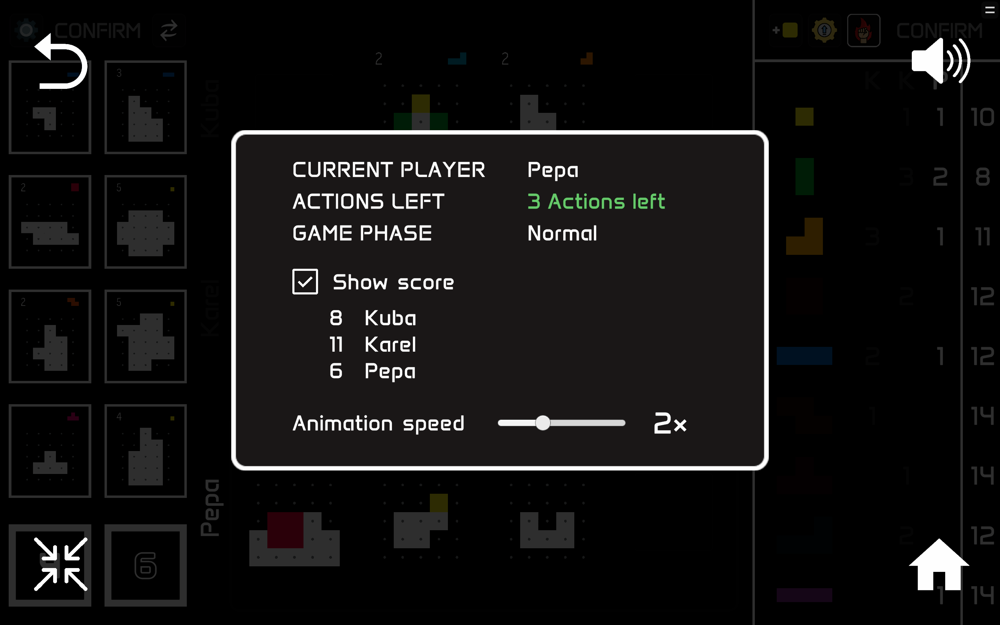

<link rel='stylesheet' href='../css/markdown-alert.css'/>

# User Guide

The rules are explained in detail in the official [rulebook](./rulebook.pdf) for the game which can be found on the [Boardcubator](https://www.boardcubator.com/games/project-l/) website. This guide doesn't go into as much detail and focuses on how to perform the actions in the application.

## Game Overview

In **Project L**, you solve puzzles by filling them in with colorful Tetris-like pieces. When you finish a puzzle, you get some points and also a new piece as a reward. By doing this, you increase your collection of pieces and can solve more difficult puzzles. If you don't have enough pieces to solve a puzzle, you can trade the pieces you have for new ones or take a new basic piece from the shared reserve.

Players take turns and in each turn they must perform 3 actions, for example: take a new puzzle and place two pieces into it. The 5 possible actions are explained bellow.

There are two kinds of puzzles - white and black. White puzzles are easier to solve and in general give less points but better pieces. Black puzzles are more difficult, but they give you a lot of points.

There are always 4 white and 4 black puzzles available to take and you can be solving up to 4 puzzles at the same time. When you take a puzzle, the column is automatically refilled with a new puzzle.

When the black deck is emptied (its number reaches 0), the end of the game is triggered. The players finish the current round and then play one final round.

If you have an unfinished puzzle at the end of the game, its points will count as negative. You don't want that. Luckily, you can try to fix this. After the game ends, each player can perform finishing touches on their unfinished puzzles. During this phase, you can place as many pieces as you want, but you cannot take any new pieces. If you finish a puzzle, you don't get any reward and the used pieces are not returned to you, however, you prevent the negative points from being counted. This, of course, has a catch - placing a piece during finishing touches is not free, but costs you 1 point for every piece.

## Creating a Game

The game can be played by both human and AI players. To add a human player, select **Human** from the player type dropdown. To add an AI player, either select the built-in **Simple AI PLayer**, or implement you own custom player. If this sounds interesting to you, check out the [AI Player Guide](../AIPlayerGuide/index) for more information.

You can set the number of pieces of each type in the game, the default is 15, but you can make this smaller to make the game more interesting.

The order in which the players will take turns is determined by the order in which they are added to the game. However, if you check the **Shuffle players** checkbox, the order will be randomized.

## Controls

| Action                         | Controls                                                     |
| ------------------------------ | ------------------------------------------------------------ |
| Confirm action / Select reward | Click `CONFIRM` button, `Enter`, `Ctrl`                      |
| Cancel action / Clear board    | Start a different action, `TAB`, `Backspace`, `C`            |
| Place piece to puzzle          | Left click on it, `Space`                                    |
| Rotate last selected piece     | Mouse wheel, up/down arrows                                  |
| Flip last selected piece       | Right click, left/right arrows                               |
| Return piece to collection     | Move it outside of your row, middle mouse button click on it |
| Open/Close pause menu          | `ESC`, `P`                                                   |
| Exit/Enter full-screen         | `F11`                                                        |

## Where is what?

The game board is divided into several zones. The **Puzzle Zone** (on the left) is where you can take new puzzles from. The **Piece Zone** (on the right) is where you can take new pieces. And the **Player Zone** in the middle is where your puzzles are located.

### Puzzle Zone

On the left is the white puzzles column and on the right is the black puzzles column. At the bottom of the column is a deck card showing the number of puzzles left in the deck. End of the game is triggered when the black deck (on the right) reaches 0.

### Player Zone

Each player has their own row in the middle of the board. The row is annotated with their name and has 4 slots for solving puzzles. The row of the current player is highlighted.

### Piece Zone

Each player has a column showing how many pieces of each type they have. On the very right is a column showing the number of pieces left in the shared reserve. The column of the current player is highlighted, alongside the pieces they own.

The current player in the picture above is Kuba. He has 2 yellow pieces, 1 green piece and 1 orange piece. You can also see that there are only 9 yellow pieces left in the shared reserve.

### Pause Menu

The pause menu is opened by pressing `ESC` or `P` and it contains a lot of useful information. It shows who is the current player, how many actions he has left in this turn, and what is the current game phase:

- Normal
- Next round is final
- Final round
- Finishing touches

You also have the option to peek at the current score of each player and to change the animation speed of the game.

Additionally, you have the option to return back to the main menu by pressing the **Home** button (top-left) and change the sound volume by pressing the **Sound** button (top-right).

## Taking New Puzzles

To take a new puzzle, simple drag it from the puzzle zone and then drop it into your puzzle row. You can either take a specific puzzle, or the top card from one of the decks, which will be a surprise for you.

When you complete a puzzle, you will be rewarded some points and a new piece. The points are specified in the top-left corner of the puzzle and the piece in the top-right corner.

## Placing Pieces

To place a piece into a puzzle, start dragging it from the piece zone. If you release the piece outside of your player row, it will return back, otherwise, it will stay where you left it. You can rotate the last selected piece with your mouse wheel and flip it with a right click.
To lock the piece into a puzzle, click on it.



To remove a locked in piece from a puzzle, simple start dragging it again. You can also clear the entire board by pressing `TAB`.

Once you have placed a piece, you can confirm the action. Additionally, you can place multiple pieces into the _same puzzle_ and confirm them all at once. This will consume one action for each piece.



When you complete a puzzle, you will get back the pieces you used to solve it, plus a new piece as a reward. To take the new piece, click on it and then click on the **Select Reward** button (or press `Enter` or `Ctrl`).

## Master Action

The most interesting mechanic of Project L is the _Master action_, which is basically a parallel place action. It allows you to place a piece into each one of your puzzles. However, you cannot place two pieces into the same puzzle. To prevent this from being too powerful, the Master action can be used only once per turn.

## Trading Pieces

If you don't have the right pieces to solve a puzzle, you can trade the pieces you have for new ones or take the basic yellow piece from the shared reserve. The level of a piece is the number of cells it covers. You can trade a piece for any piece of the same or lower level, or of one level higher.

## Recycle Action

If you don't like any of the puzzles available, you can recycle the white / black column. This will put the puzzles in the bottom of the deck (in the order they were selected) and refill the column with new puzzles.

